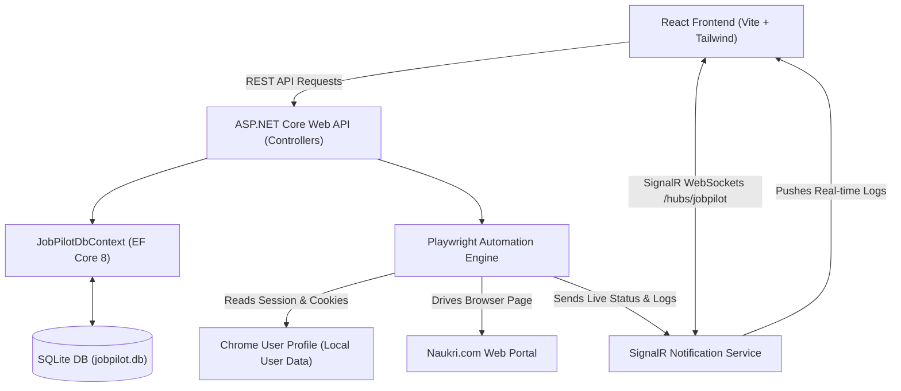
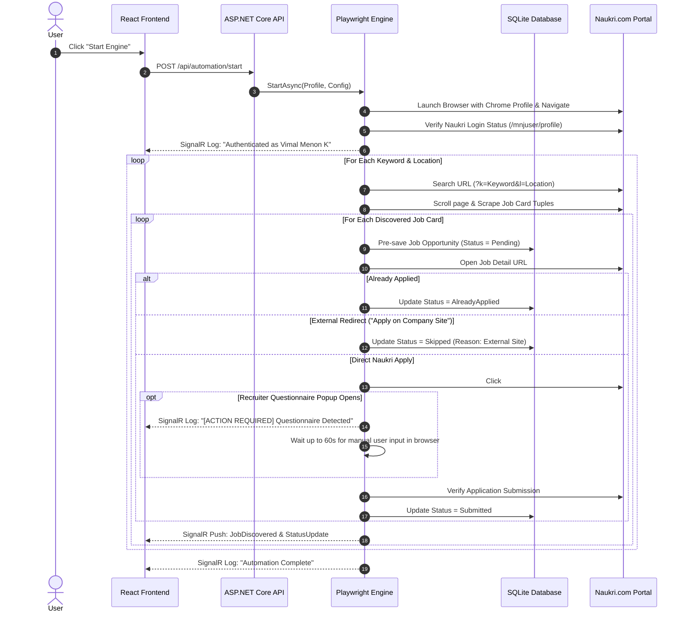
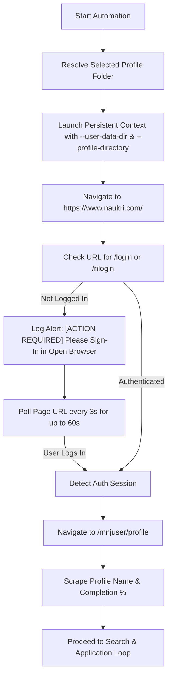

# 🤖 JobPilot AI

> **Enterprise Direct Naukri & Job Board Application Automation Platform**
> 
> *Automate direct job applications on Naukri.com using your installed Google Chrome / Microsoft Edge browser profiles, persistent login sessions, intelligent DOM element detection, and real-time execution analytics.*


---

## 📌 Table of Contents

- [Overview](#-overview)
- [Features](#-features)
- [Tech Stack](#-tech-stack)
- [Architecture](#-architecture)
- [Folder Structure](#-folder-structure)
- [Backend Architecture](#-backend-architecture)
- [Frontend Architecture](#-frontend-architecture)
- [Database Schema](#-database-schema)
- [API Documentation](#-api-documentation)
- [Authentication Flow](#-authentication-flow)
- [Automated Job Application Flow](#-automated-job-application-flow)
- [Browser Automation Engine](#-browser-automation-engine)
- [Environment Variables](#-environment-variables)
- [Configuration Files](#-configuration-files)
- [Installation Guide](#-installation-guide)
- [Build Instructions](#-build-instructions)
- [Deployment Guide](#-deployment-guide)
- [Logging System](#-logging-system)
- [Security Practices](#-security-practices)
- [Performance Optimizations](#-performance-optimizations)
- [Future Enhancements](#-future-enhancements)
- [Troubleshooting](#-troubleshooting)
- [Contributing](#-contributing)
- [License](#-license)

---

## 🚀 Overview

### Business Problem
Job seekers spend hours daily manually navigating job portals like Naukri.com, opening individual job cards, evaluating application types, filtering out third-party recruiter redirects, filling out repetitive experience popups, and keeping manual application logs. Existing web scrapers fail because they rely on ephemeral temporary browser profiles that get blocked by Cloudflare/bot protection or lose logged-in session cookies, forcing users to repeatedly authenticate or solve CAPTCHAs.

### The Solution: JobPilot AI
**JobPilot AI** solves this problem by connecting directly to the user's **installed Google Chrome or Microsoft Edge browser user profile** (reusing existing login sessions, cookies, autofill, saved passwords, and history). 

It automatically searches target job titles, keywords, locations, and experience criteria on Naukri.com, filters out external company-site redirects ("Apply on Company Site"), deduplicates against previously submitted listings, pre-saves entries to a local SQLite database, clicks **Direct Apply**, and intelligently handles recruiter experience questionnaires. If a questionnaire modal opens (asking for notice period, current CTC, or experience), the engine pauses navigation and provides an interactive window for the user to answer directly in the open browser before cleanly resuming verification.

### Target Audience
- Software engineers, IT developers, and professionals seeking streamlined job application workflows.
- Candidates managing high-volume job applications across multiple locations (e.g., Kerala, Bangalore, Remote).
- Developers looking for a modern, decoupled C# + React architecture example integrating Playwright automation with SignalR WebSockets.

---

## ✨ Features

### 🔐 Authentication & Browser Profile Management
- **Native Chrome & Edge Profile Scanner**: Auto-detects installed user profiles (`Default`, `Personal`, `Profile 1`, etc.) and reads custom display names from Chrome's `Local State` JSON cache.
- **Persistent Session Reuse**: Launches Chrome/Edge using `--user-data-dir` and `--profile-directory`, preserving active Naukri login sessions, cookies, and credentials.
- **CDP Port 9222 Remote Debugging**: Can connect directly over Chrome DevTools Protocol (`http://localhost:9222`) if Chrome is already open.
- **Automatic Profile Data Fallback Sync**: If Chrome is locked by an existing process, the engine automatically syncs essential session cookies to a dedicated user data directory so automation never fails.

### 🔍 Search & Intelligent Filtering
- **Multi-Keyword & Multi-Location Loops**: Iterates through configured lists of search keywords (e.g., `.NET Core`, `ASP.NET`, `C#`) and locations (e.g., `Kerala`, `Bangalore`, `Remote`).
- **Experience & Salary Filter Matching**: Filters job cards according to configured minimum/maximum experience years (`0-5 yrs`) and salary LPA bounds (`₹3,00,000 - ₹15,00,000`).
- **External Redirect Skipping**: Automatically inspects apply buttons and skips external company site redirects (`Apply on Company Site`, `Redirect to Employer Website`), recording them as `Skipped` in history without wasting the daily application quota.
- **Walk-in Posting Detection**: Identifies physical walk-in interview notices without online apply buttons and marks them as `Skipped`.
- **Deduplication Engine**: Checks SQLite history by Naukri External ID (`NAUKRI-XXXXXXXX`) to skip already submitted or applied opportunities.

### ⚡ Automated Application & Questionnaire Handler
- **Immediate Direct Apply**: Applies to direct Naukri listings (`Apply`, `Apply Now`, `Quick Apply`) instantly upon card discovery.
- **Interactive Recruiter Questionnaire Pause**: Detects recruiter experience modals, chatbot drawers (`.chatbot`, `.questionnaire`, `.bot-container`), and pauses navigation up to 60 seconds (polling every 3s) so the user can enter custom answers in the open browser window.
- **Automatic Verification**: Verifies application confirmation text (`Application Submitted`, `Already Applied`) and updates status records.

### 📊 Executive Dashboard & Monitoring
- **Real-Time SignalR WebSockets**: Streams live execution status, current search keyword/location, discovered job cards, and system logs to the React frontend.
- **Glassmorphic Modern UI**: Dark-themed dashboard built with React 19, Tailwind CSS, Lucide icons, and Recharts analytics.
- **Application History & Analytics**: History table with status filtering (`Submitted`, `Skipped`, `AlreadyApplied`, `Failed`), CSV data export, and weekly/monthly performance graphs.

---

## 🛠️ Tech Stack

### Backend
- **Framework**: ASP.NET Core 8.0 Web API
- **Language**: C# 12 / .NET 8 SDK
- **Automation Engine**: Microsoft Playwright .NET `v1.42.0`
- **Database ORM**: Entity Framework Core `v8.0.2` (SQLite Provider)
- **Real-Time Communication**: ASP.NET Core SignalR
- **Logging**: Serilog `v8.0.1` (AspNetCore, Console, File sinks)
- **API Documentation**: Swashbuckle Swagger UI `v6.5.0`

### Frontend
- **Framework**: React `v19.0` (with Vite `v5.4 / v8.1`)
- **Language**: TypeScript `v5.2 / v6.0`
- **State & Data Fetching**: TanStack React Query `v5.101`
- **Real-Time Client**: `@microsoft/signalr` `v10.0`
- **Styling**: Tailwind CSS `v3.4 / v4.0`, PostCSS, Autoprefixer
- **UI Components & Icons**: Lucide React `v1.25`, Framer Motion `v12.42`
- **Analytics & Data Vis**: Recharts `v3.10`

### Database & Storage
- **Engine**: SQLite 3 (`jobpilot.db`)
- **Persistence**: File-based local SQLite DB with `PRAGMA table_info` migration checks on startup

---

## 🏗️ Architecture

JobPilot AI uses a clean, decoupled architecture separating the frontend client, backend REST API/WebSocket hub, SQLite database, and headless/headful Playwright browser instances.



### Data Flow Diagram



---

## 📁 Folder Structure

```text
Job-Application-Project/
├── backend/
│   ├── JobPilot.sln                         # Visual Studio Solution File
│   ├── JobPilot.Domain/                     # Core Domain Entities & Enums
│   │   ├── JobPilot.Domain.csproj
│   │   └── Entities.cs                      # JobOpportunity, SearchProfile, AutomationConfig, etc.
│   ├── JobPilot.Application/                # Data Transfer Objects & Interfaces
│   │   ├── JobPilot.Application.csproj
│   │   ├── DTOs.cs                          # JobOpportunityDto, DashboardStatsDto, etc.
│   │   └── Interfaces.cs                    # IJobRepository, IAutomationEngine, etc.
│   ├── JobPilot.Infrastructure/             # DB Context, Repositories, Playwright & Hubs
│   │   ├── JobPilot.Infrastructure.csproj
│   │   ├── Persistence/
│   │   │   └── JobPilotDbContext.cs         # EF Core Database Context
│   │   ├── Repositories/
│   │   │   └── Repositories.cs              # EF Core Repositories (with AsNoTracking & Detach)
│   │   └── Services/
│   │       ├── ChromeProfileScanner.cs      # Native Chrome User Data scanner
│   │       └── PlaywrightAutomationEngine.cs# Core Playwright Naukri Automation Logic
│   └── JobPilot.Api/                        # Web API Controllers & Host Setup
│       ├── JobPilot.Api.csproj
│       ├── Program.cs                       # App Bootstrap, CORS, SignalR, & PRAGMA migrations
│       ├── appsettings.json                 # DB connection string & logging configs
│       └── Controllers/
│           └── JobPilotControllers.cs       # Dashboard, Jobs, Automation, Config, Logs, Analytics
└── frontend/
    ├── package.json                         # Dependencies & Scripts
    ├── vite.config.ts                       # Vite Configuration & API Proxy
    ├── tsconfig.json                        # TypeScript Configuration
    ├── tailwind.config.js                   # Tailwind CSS Configuration
    ├── postcss.config.js                    # PostCSS Setup
    ├── index.html                           # Single Page Application HTML Entrypoint
    └── src/
        ├── index.css                        # Global Styles & Glassmorphic Utilities
        ├── main.tsx                         # React Application Mounting
        ├── App.tsx                          # Main Layout & Tab Router
        ├── types/
        │   └── index.ts                     # TypeScript Types & DTO Interfaces
        ├── services/
        │   └── api.ts                       # Axios/Fetch API Client & SignalR Hub Client
        ├── components/
        │   ├── Navbar.tsx                   # Top Navigation Header
        │   ├── Sidebar.tsx                  # Sidebar Navigation
        │   └── Header.tsx                   # Status Bar Header
        └── pages/
            ├── DashboardPage.tsx            # Analytics Overview & Live Status
            ├── AutomationPage.tsx           # Profile Selector & Execution Log Console
            ├── HistoryPage.tsx              # Application Records & CSV Export
            ├── SearchProfilesPage.tsx       # Keyword & Location Tag Manager
            ├── ConfigurationPage.tsx        # Runner Settings & Delay Controls
            ├── LogsPage.tsx                 # Detailed System Audit Logs
            └── AnalyticsPage.tsx            # Charts & Performance Breakdown
```

---

## ⚙️ Backend Architecture

The backend follows **Clean Architecture** principles split into four projects:

1. **`JobPilot.Domain`**: Contains core domain models (`JobOpportunity`, `SearchProfile`, `AutomationConfig`, `AutomationLog`, `AutomationSession`) and enums (`JobStatus`, `BrowserType`, `RunnerState`, `WorkType`, `LogLevelSeverity`).
2. **`JobPilot.Application`**: Defines DTO records (`JobOpportunityDto`, `DashboardStatsDto`, etc.) and abstract interfaces (`IJobRepository`, `ISearchProfileRepository`, `IAutomationConfigRepository`, `ILogRepository`, `IAutomationEngine`, `INotificationHubService`).
3. **`JobPilot.Infrastructure`**:
   - `JobPilotDbContext`: EF Core context mapping domain models to SQLite tables.
   - `Repositories`: Thread-safe data access repository implementations. `GetByExternalIdAsync` uses `.AsNoTracking()`, and `AddAsync`/`UpdateAsync` execute entity detachment (`EntityState.Detached`) to prevent EF Core identity map tracking conflicts during concurrent automation loops.
   - `ChromeProfileScanner`: Inspects `AppData\Local\Google\Chrome\User Data` and reads `Local State` JSON cache to identify profiles like `Default`, `Personal`, `Profile 1`, `Profile 2`.
   - `PlaywrightAutomationEngine`: Asynchronous engine executing search, parsing, DOM navigation, apply button locating, questionnaire pause loops, and status notifications.
4. **`JobPilot.Api`**: Exposes REST API endpoints and SignalR WebSockets at `/hubs/jobpilot`.

---

## 💻 Frontend Architecture

The frontend is a single-page application built with **React 19**, **TypeScript**, and **Tailwind CSS**:

- **API Communication (`src/services/api.ts`)**: Uses the native `Fetch API` for REST requests and `@microsoft/signalr` for real-time WebSocket logs. It dynamically inspects `import.meta.env.VITE_API_URL` to route requests to local backend or Cloudflare/ngrok tunnels when hosted on platforms like Vercel.
- **State Management**: Uses **TanStack React Query (`useQuery`, `useMutation`)** for caching API data and managing asynchronous state transitions.
- **Real-Time Log Stream**: `SignalRService` connects to `/hubs/jobpilot` and subscribes to `ReceiveLog`, `ReceiveStatusUpdate`, and `ReceiveJobDiscovered` events, appending live logs directly into the execution console without manual polling.

---

## 🗄️ Database Schema

Database table structures managed via Entity Framework Core SQLite provider in `jobpilot.db`:

### 1. `Jobs` Table (`JobOpportunity`)
| Column | Type | Constraints | Description |
| :--- | :--- | :--- | :--- |
| `Id` | `GUID` | Primary Key | Unique internal identifier |
| `ExternalId` | `TEXT` | Unique Index | Naukri Job ID (e.g. `NAUKRI-20F45EAA`) |
| `Title` | `TEXT` | Required | Job title |
| `Company` | `TEXT` | Required | Hiring organization name |
| `Location` | `TEXT` | Required | Target location(s) |
| `MinimumSalary` | `REAL` | Nullable | Minimum salary bounds (INR ₹) |
| `MaximumSalary` | `REAL` | Nullable | Maximum salary bounds (INR ₹) |
| `Currency` | `TEXT` | Default `'INR'` | Currency type |
| `EmploymentType`| `TEXT` | Default `'Full Time'` | Employment type |
| `WorkType` | `INTEGER`| Enum | `FullTime`, `Remote`, `Hybrid`, `Contract` |
| `IsRemote` | `INTEGER`| Boolean | Is position remote |
| `ExperienceYears`| `INTEGER`| Default `0` | Required experience years |
| `PostedDate` | `TEXT` | DateTime | Job posting date |
| `Description` | `TEXT` | String | Scraped job summary & skills |
| `Url` | `TEXT` | Required | Full absolute Naukri job link |
| `Status` | `INTEGER`| Enum | `0=Pending`, `1=Reviewed`, `2=Submitted`, `3=Skipped`, `4=Failed`, `5=AlreadyApplied` |
| `Skills` | `TEXT` | String | Comma-separated required tech skills |
| `ApplicationNotes`| `TEXT` | String | Log notes / reason for status |
| `CreatedAt` | `TEXT` | DateTime | Discovery timestamp |
| `UpdatedAt` | `TEXT` | Nullable DateTime | Last modified timestamp |

### 2. `SearchProfiles` Table (`SearchProfile`)
Stores target search parameters: `KeywordsJson`, `LocationsJson`, `MinimumExperience`, `MaximumExperience`, `MinimumSalary`, `MaximumSalary`, `ExpectedCtcLpa`, `PostedWithinDays`, `ExcludedCompaniesJson`, `IsActive`.

### 3. `AutomationConfigs` Table (`AutomationConfig`)
Stores runner configurations: `MaxJobsToProcess`, `DelayBetweenActionsSeconds`, `RandomizeDelay`, `Headless`, `PreferredBrowser`, `SelectedChromeProfile`, `RetryFailedOperations`, `MaxRetryCount`.

### 4. `AutomationLogs` Table (`AutomationLog`)
Stores audit logs: `Id`, `Timestamp`, `Level` (`Info`, `Warning`, `Error`), `Category`, `Message`, `Details`, `JobId`.

---

## 📡 API Documentation

### 📊 Dashboard Controller (`/api/dashboard`)

#### `GET /api/dashboard/stats`
- **Purpose**: Returns high-level metrics, active browser profile status, login name, and today's application totals.
- **Auth**: None
- **Response Example**:
```json
{
  "chromeConnected": "Chrome Connected",
  "browserProfile": "C:\\Users\\Vimal\\AppData\\Local\\Google\\Chrome\\User Data\\Personal",
  "currentAccountName": "Vimal Menon K",
  "currentEmail": "vimal... (Naukri Verified)",
  "profileCompletion": "100%",
  "resumeLastUpdated": "Active Resume Attached",
  "applicationsToday": 5,
  "jobsFound": 18,
  "jobsSubmitted": 5,
  "jobsSkipped": 12,
  "failedAttempts": 0,
  "pendingReview": 0,
  "automationStatus": "Idle",
  "currentKeyword": ".NET Developer",
  "currentLocationFilter": "Kerala, Bangalore",
  "lastScanTime": "02:15:30 PM"
}
```

#### `GET /api/dashboard/activity`
- **Purpose**: Returns 7-day activity metrics for dashboard charts.

---

### 💼 Jobs Controller (`/api/jobs`)

#### `GET /api/jobs`
- **Query Params**: `status` (optional), `search` (optional)
- **Purpose**: Returns filtered list of job opportunity records.

#### `GET /api/jobs/{id}`
- **Purpose**: Fetch single job record by GUID.

#### `POST /api/jobs/{id}/status`
- **Body**: `{ "status": "Submitted", "applicationNotes": "Updated manually" }`
- **Purpose**: Update status and notes for a specific job.

#### `POST /api/jobs/bulk-status`
- **Body**: `{ "jobIds": ["guid-1", "guid-2"], "status": "Submitted" }`
- **Purpose**: Bulk status modification.

#### `GET /api/jobs/export`
- **Purpose**: Generates and downloads a `.csv` export of application history (`naukri_jobpilot_history_YYYYMMDD.csv`).

---

### 🤖 Automation Controller (`/api/automation`)

#### `POST /api/automation/start`
- **Purpose**: Launches the asynchronous Playwright Naukri automation workflow.

#### `POST /api/automation/pause`
- **Purpose**: Temporarily pauses automation loop using `ManualResetEventSlim`.

#### `POST /api/automation/resume`
- **Purpose**: Resumes paused automation loop.

#### `POST /api/automation/stop`
- **Purpose**: Cancels `CancellationTokenSource` and closes active browser session.

#### `GET /api/automation/status`
- **Purpose**: Returns current `RunnerState` and session metrics.

---

### ⚙️ Config Controller (`/api/config`)

#### `GET /api/config/profile` | `PUT /api/config/profile`
- **Purpose**: Fetch or update search parameters (keywords, locations, LPA, experience).

#### `GET /api/config/chrome-profiles`
- **Purpose**: Returns list of installed Chrome user profiles detected on host OS.

#### `GET /api/config/runner` | `PUT /api/config/runner`
- **Purpose**: Fetch or update runner settings (preferred browser, selected profile, delay seconds, apply limit).

---

### 📜 Logs Controller (`/api/logs`)

#### `GET /api/logs`
- **Query Params**: `level`, `category`, `limit` (default 100)
- **Purpose**: Returns execution logs.

#### `DELETE /api/logs`
- **Purpose**: Clears all entries from `AutomationLogs` table.

---

### 📈 Analytics Controller (`/api/analytics`)

#### `GET /api/analytics`
- **Purpose**: Returns top company metrics, top locations, top keywords, success rate, and weekly/monthly charts.

---

## 🔑 Authentication Flow



1. **Browser Profile Resolution**: `ChromeProfileScanner.ResolveProfileFolder` matches user selection (e.g. `Personal`) to the actual Chrome folder (e.g. `Profile 1`).
2. **Persistent Context Launch**: `LaunchPersistentContextAsync` attaches your desktop Chrome user data. Session cookies (`naukri.com`) are loaded automatically.
3. **Login Verification**: The engine checks whether current page URL redirects to `/login` or `/nlogin`.
4. **Interactive Login Fallback**: If unauthenticated, the engine logs an `[ACTION REQUIRED]` warning and waits up to 60 seconds while polling URL state. The user can type credentials directly into the open browser window. Once authenticated, the engine resumes.
5. **Profile Metadata Scraper**: Navigates to `https://www.naukri.com/mnjuser/profile` to scrape profile completion percentage (e.g. `100%`) and updated resume details.

---

## 🔄 Automated Job Application Flow

1. **Configuration & Target Loading**: The engine retrieves active search keywords (`.NET Developer`, `C#`) and locations (`Kerala`, `Bangalore`, `Remote`).
2. **Naukri Query Construction**: Constructs clean Naukri URL slugs:
   `https://www.naukri.com/{keyword-slug}-jobs-in-{location-slug}?k={keyword}&l={location}&experience={minExp}`
3. **Page Navigation & Lazy-Load Trigger**: Navigates to the search page, pauses 2s, and executes `window.scrollBy(0, 500)` so React job cards finish rendering.
4. **Job Card Extraction**: Extracts job title, company, location, experience range, salary text, skills tags, and job link URL.
5. **Pre-Persistence**: Immediately saves discovered jobs to SQLite with status `Pending`.
6. **Already Applied Check**: Inspects job page status badges (`.already-applied`, `.applied-badge`). Ignores header navigation menu items like "Applied Jobs".
7. **External Redirect Filter**: Checks apply button text. If it contains "Company Site", "Company Website", or "Redirect to Company", the engine logs `Skipped` with reason `External Company Application`.
8. **Direct Apply Submission**: Clicks the primary apply button (`#apply-button`, `button.apply-button`).
9. **Questionnaire Modal Handling**: If a chatbot/questionnaire modal opens (`.chatbot`, `.questionnaire`, `.bot-container`), the engine logs:
   > `[ACTION REQUIRED] Questionnaire / experience popup detected for 'Job Title'. Please answer the questions in the open browser window...`
   It pauses up to 60 seconds, polling every 3 seconds for popup closure before completing verification.
10. **SignalR Broadcast**: Streams updated stats, jobs, and logs to the React dashboard.

---

## 🌐 Environment Variables

| Variable | Description | Required | Default / Example |
| :--- | :--- | :--- | :--- |
| `VITE_API_URL` | Frontend API & SignalR endpoint (used for local tunnels or production hosting) | Optional | `https://xxxx.trycloudflare.com` |
| `ConnectionStrings__DefaultConnection` | SQLite Connection String | Optional | `Data Source=jobpilot.db` |
| `ASPNETCORE_ENVIRONMENT` | ASP.NET Core environment mode | Optional | `Development` |
| `PORT` | Backend HTTP Port | Optional | `5000` |

---

## ⚙️ Configuration Files

- **`backend/JobPilot.Api/appsettings.json`**: DB connection strings, Serilog log sinks.
- **`backend/JobPilot.Api/launchSettings.json`**: IIS Express and Kestrel profiles listening on port `5000`.
- **`frontend/vite.config.ts`**: Vite dev server config, path aliases (`@/*`), and backend proxy rules.
- **`frontend/package.json`**: Frontend dependency tree and scripts (`dev`, `build`, `lint`).
- **`frontend/tsconfig.json`**: TypeScript compiler options, JSX transform rules, and bundler resolution.
- **`frontend/tailwind.config.js`**: Tailwind CSS theme settings and content paths.
- **`frontend/postcss.config.js`**: PostCSS plugin definitions for Tailwind and Autoprefixer.

---

## 📥 Installation Guide

### Prerequisites
- **.NET 8.0 SDK** ([Download .NET 8](https://dotnet.microsoft.com/download/dotnet/8.0))
- **Node.js** (v18.0 or higher) & **npm** ([Download Node.js](https://nodejs.org/))
- **Google Chrome** or **Microsoft Edge** installed on Windows/Linux/macOS

### 1. Clone the Repository
```bash
git clone https://github.com/vimalmenonk/Job-Application-Project.git
cd Job-Application-Project
```

### 2. Backend Setup
```powershell
cd backend
dotnet restore
dotnet build JobPilot.sln
```

### 3. Install Playwright Browsers (First Time Only)
```powershell
pwsh backend/JobPilot.Api/bin/Debug/net8.0/playwright.ps1 install chromium
```

### 4. Frontend Setup
```powershell
cd ../frontend
npm install
```

---

## 🛠️ Build Instructions

### Building Backend
```powershell
cd backend
dotnet build JobPilot.sln --configuration Release
```

### Building Frontend
```powershell
cd frontend
npm run build
```

---

## 🚀 Deployment Guide

### Running Locally (Desktop Mode)

1. **Start Backend API**:
   ```powershell
   cd backend
   dotnet run --project JobPilot.Api/JobPilot.Api.csproj
   ```
2. **Start Frontend Dev Server**:
   ```powershell
   cd frontend
   npm run dev
   ```
3. Open `http://localhost:5173` in your browser.

---

### Deploying Frontend to Vercel with Local Backend Tunnel

Since Playwright uses your **installed local Chrome profile**, run the backend locally and expose a secure HTTPS tunnel for your Vercel frontend:

1. **Start Local Backend**:
   ```powershell
   dotnet run --project backend/JobPilot.Api/JobPilot.Api.csproj
   ```
2. **Expose Local Tunnel**:
   ```powershell
   npx cloudflared tunnel --url http://localhost:5000
   ```
   *(Copy the generated URL, e.g. `https://xxxx.trycloudflare.com`)*
3. **Configure Vercel**:
   - Import your GitHub repo on Vercel.
   - Set **Root Directory**: `frontend`
   - Set **Framework Preset**: `Vite`
   - Add Environment Variable:
     - **Key**: `VITE_API_URL`
     - **Value**: `https://xxxx.trycloudflare.com`
4. **Deploy**: Click **Deploy** on Vercel!

---

## 📝 Logging System

- **Serilog Integration**: Logs to Console, `jobpilot-.log` files, and the SQLite `AutomationLogs` table.
- **Log Levels**: `Info` (general status), `Warning` (popups, missing selectors, retries), `Error` (crashes, timeouts).
- **Real-Time Streaming**: Pushed instantaneously to the React UI execution console via SignalR WebSockets (`/hubs/jobpilot`).

---

## 🛡️ Security Practices

- **CORS Protection**: Programmed with `policy.SetIsOriginAllowed(_ => true)` to support Vercel deployments and Cloudflare/ngrok HTTPS tunnels securely with credentials.
- **Parameterized SQL Queries**: All database queries use EF Core parameterized statements. Startup schema column migrations check `PRAGMA table_info` metadata before executing `ALTER TABLE`.
- **Sensitive Profile Protection**: User Chrome data is accessed locally on the user's host machine and is never sent to third-party cloud servers.

---

## ⚡ Performance Optimizations

- **`AsNoTracking()` Query Scoping**: Prevents EF Core identity map tracking overhead during repetitive database reads.
- **Entity Detachment**: `AddAsync` and `UpdateAsync` detach existing local entity instances (`EntityState.Detached`) to eliminate tracking conflicts during rapid application loops.
- **DOM Lazy-Load Scrolling**: Scroll triggers force React job cards on Naukri to load without requiring page reloads.
- **Vite Asset Bundling**: Minified JavaScript and CSS chunks with gzip compression.

---

## 🔮 Future Enhancements

- [ ] **AI Questionnaire Auto-Answer Engine**: Integrate LLM (Gemini / OpenAI API) to automatically generate answers for recruiter experience popups based on resume text.
- [ ] **LinkedIn Easy Apply Integration**: Extend Playwright engine to automate LinkedIn Easy Apply listings alongside Naukri.
- [ ] **Desktop Notification Sound Effects**: Audio alerts when questionnaire popups open or daily target limits are reached.
- [ ] **Dockerized Container Deployment**: Package Playwright + headless Chromium into a standalone Docker image.

---

## ❓ Troubleshooting

### 1. `SQLite Error 1: 'no such column'`
- **Fix**: Restart backend API (`dotnet run`). `Program.cs` automatically executes `PRAGMA table_info` checks and migrates missing columns on startup.

### 2. `The process cannot access the file ... because it is being used by another process`
- **Fix**: Stop any active `JobPilot.Api` background processes:
  ```powershell
  Stop-Process -Name "JobPilot.Api", "dotnet" -Force
  ```

### 3. Vercel Frontend Returning `404 NOT_FOUND` on API Calls
- **Fix**: Ensure environment variable `VITE_API_URL` is set in Vercel settings pointing to your active Cloudflare/ngrok tunnel URL (`https://xxxx.trycloudflare.com`), then trigger a **Redeploy** on Vercel.

---

## 🤝 Contributing

Contributions are welcome! Please follow these guidelines:

1. **Branch Naming**:
   - `feature/your-feature-name`
   - `fix/your-bug-fix`
2. **Commit Messages**:
   - `feat: add LinkedIn Easy Apply locator`
   - `fix: resolve questionnaire popup timeout`
3. **Pull Request Workflow**:
   - Ensure `dotnet build JobPilot.sln` and `npm run build` pass with 0 errors before opening a PR.

---


<p center>
Made with ❤️ for automated, hassle-free job searching.
</p>
